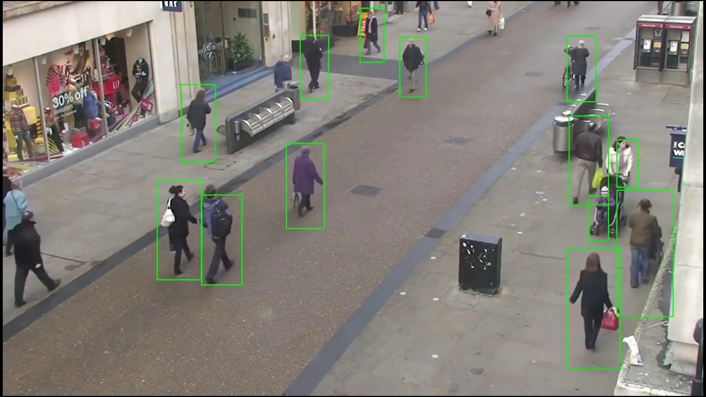
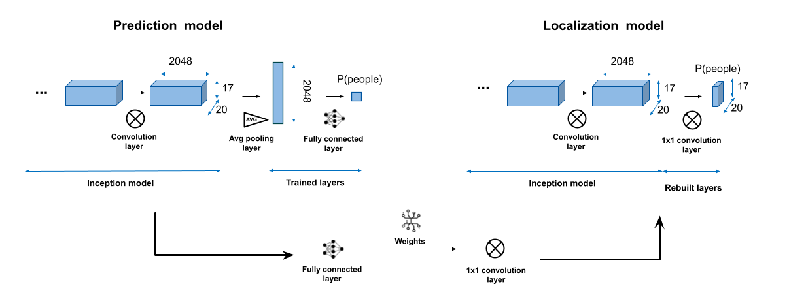
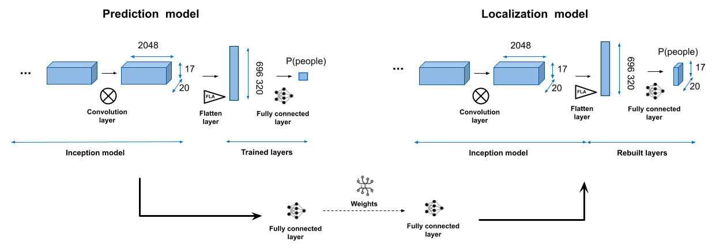
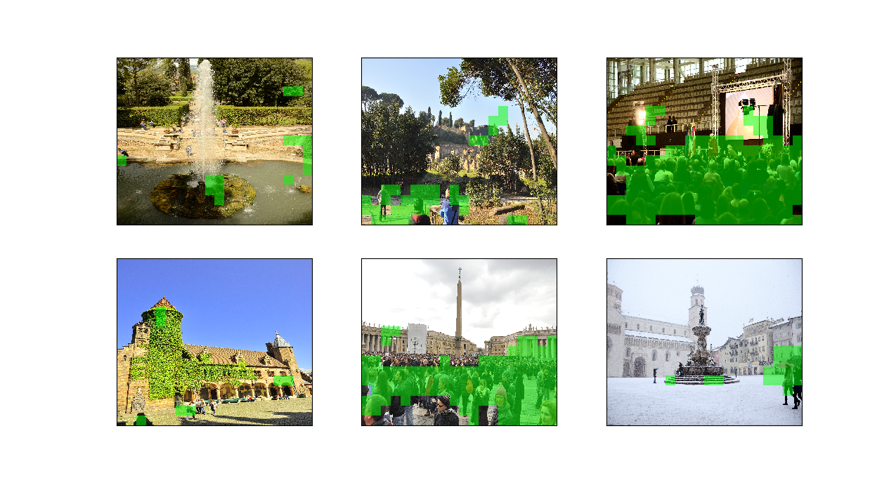

# Person detection using classification networks


_Detection of people in a picture_

This AI project's goal is to detect people in images using a standard CNN classification approach.
It was made in collaboration with RWTH Aachen university.

## Overview

This project is based on the [Silverpond article on pedestrian detection](https://silverpond.com.au/2016/10/24/pedestrian-detection-using-tensorflow-and-inception/). The goal is to detect where people are in presented images, using a standard CNN-based neural network trained on simple classification tasks (if people are present or not in analyzed images).

This project is built modularly, to help us try different models and parameters.

The current results were determined using pretrained [Inception v3 on keras](https://keras.io/api/applications/inceptionv3/) model and [RAISE dataset](http://loki.disi.unitn.it/RAISE/index.php).

## Table of contents

1. [Tools](#tools)
    a. [Raise dataset](#raise-dataset)
    b. [Inception model](#inception-model)
2. [Overall procedure](#overall-procedure)
    a. [Pre-processing](#pre-processing)
    b. [Training of the detection model](#training-of-the-detection-model)
    c. [Building of the localization model](#building-of-the-localization-model)
    d. [Testing](#testing)
    e. [Further steps](#further-steps)
3. [Current work](#current-work)
    a. [Data pre-processing](#data-pre-processing)
    b. [Build the model](#build-the-model)
    c. [Training](#training)
    d. [People localization](#people-localization)
    e. [Results](#results)
4. [Project structure](#project-structure)
5. [Code structure](#code-structure)
    a. Dataset formatting
    b. Preprocessing
    c. Preprocessing for isolated images
    d. Training
    e. Prediction
    f. Visualization performance
    g. Localization model build
    h. Localization model prediction
    i. Visualization of localization
    j. Train model compiler
    k. Run model compiler
6. [The scripts](#the-scripts)
    a. train_model.py script
    b. run_model.py script
7. [Presentation of the most important functions](#presentation-of-the-most-important-functions)
    a. train_model_from_scratch
    b. run_trained_model
    c. create_formatted_dataset
    d. pre_processing_train
    e. preprocess_images
    f. train_model
    g. predict_class
    h. visualize
    i. build_localization_model
    j. predict_localization
    k. generate_localization_images
8. [Sources and aknowledgements](#sources-and-aknowledgements)

## Tools

### Raise dataset

Real-world dataset made up of 13,000 images labeled in different categories (_outdoor_, _indoor_, _landscape_, _nature_, _people_, _object_ and _building_).

71% of the images of size 4928\*3264, 28% of size 4288\*2848, 1% of size 3008\*2000, both in vertical and horizontal directions.

The dataset is unbalanced in our case: only 13% of the images were labeled _people_.

### Inception model

The **Inception v3** model was built by Google for image analysis and object detection. It was trained on ImageNet database to classify images into 1000 object categories, and present an accuracy of 78.1%.

## Overall procedure

We constructed and trained the localization model using the following procedure:
- Pre-processing
- Training of the detection model
- Building of the localization model
- Testing

### Pre-processing

The pre-processing step essentially consisted of:
- Filtering, i.e. removing useless data
- Resizing the other images in a common shape
- Normalizing color values to match the model rules
- Setting up the right category values

### Training of the detection model

To avoid retraining a full model on a large dataset, we use here a pretrained model as the basis of our new one (transfer learning).

The idea here is to remove the last fully-connected layers (trained to specifically predict the categories the initial model was trained on) and to retrain new ones, while conserving the other layer weights.

.png)
_Training of the detection model based on Inception v3_

**Remark:** to ease the localization model build, we must ensure that only the last layer is a fully connected one (then the previous one is either a flattening or a pooling one, and we may put before some other convolutional layers).

### Building of the localization model

Now, we must
- Take the weights of the last fully-connected layers
- Remove the fully-connected and the pooling layers
- Add a new layer using the weights of the last fully-connected on a new layer with the same number outputs than the last convolution one, correponding to the different parts of the image. We can use the softmax activation function, to produce the probability to have a person (or only a part) in each image part.

.png)
_Building of the localization model from the trained detection one, here using Inception model with a pooling layer_

### Testing

The localization model is harder to test, as we only have categories for full images.

We can firstly verify that predictions are good just by looking at the results. To quantify the error, we must label the different parts by hand and use standard metrics, like the intersection-over-union one.

Another important parameter to tune is the threshold level: should we predict that a person is present on the part if the output probability is superior than 0.5? 0.4?
We can also use adaptive techniques, like Otsu's method.

### Further steps

We can then train a model to draw squares for a better visualization.


_Example of people localization in an image using squares_

## Current work

Even if the repository is designed to test a lot of different model architectures and parameters, only a few have been explored.

### Data pre-processing

- Only images from the RAISE dataset have been used for now to train the model. Unfortunately, only a small part of these images show people (the dataset is deeply unbalanced). For this reason, it may be interesting to train the model with other datasets.

- Only images in landscape mode and of size 4928\*3264 or 4288\*2848 have been used to train the model.

- All images have then been resized in a 600*700 landscape format.

- We have either taken all the images for the training (unbalanced dataset), or only a part of the non-people images to build a balanced dataset.

### Build the model

All models have been built using pre-trained Inception-v3: the last fully-connected layers were removed, and new ones were added and trained (the Inception-v3 layer weights were left untouched).

Two different architectures have been tested. 

- The first one consists of adding an average pooling layer to get a 1D 2048 array of features as the output (corresponding to the features predicted by Inception-v3 on each part of the image), and then train a fully-connected layer on this output predicting the image class (probability to have a people in the picture).
Once trained, these two layers are removed and a new 1*1 convolutional layer with the same weights, to output a class for each part of the image.


_Construction of the localization model using a pooling layer_

- The second one consists of adding a Flatten layer to get a huge 1D vector, and then train a fully-connected layer to predict the image class.
Once trained, the fully-connected layer with a global output is replaced by a fully-connected layer with one output per image part, using the same weights as before: each output is built from the image part features and the corresponding weights.


_Construction of the localization model using a flatten layer_

### Training

We tested different parameters during the training:
- We used the Adam optimizer
- We tried different learning rates (from 1e-5 to 1e-2)
- We tried different losses (binary crossentropy or weighted binary crossentropy)
- We tried different batch sizes (from 50 to 150 images)
- We tried different numbers of epochs (30, 40, early stopping based on the loss evolution)

### People localization

To assess if a person was present in a picture part, we either used a fixed threshold (e.g. 0.5), or an adaptive one (Otsu's method).

### Results


The best model (in term of its localization results) was trained of the following parameters:

|run_id             |filter_with_size|filter_with_mode|nb_images|is_balanced|final_size|with_augmentation|optimizer|learning_rate|loss               |batch_size|num_epo|class_weights|early_stopping|model_type|accuracy          |f1_score          |
|-------------------|----------------|----------------|---------|-----------|----------|-----------------|---------|-------------|-------------------|----------|-------|-------------|--------------|----------|------------------|------------------|
|2021_07_06-16_53_02|True            |True            |-1       |False      |(600, 700)|False            |adam     |0.001        |binary_crossentropy|150       |40     |None         |True          |flatten   |0.9299738219895288|0.7551487414187643|

And here is an example of what it can do:


_Localization of the currently best model on some images_

Here is the summary of all the trainings:

|run_id               |filter_with_size|filter_with_mode|nb_images|is_balanced|final_size|with_augmentation|optimizer|learning_rate|loss                        |batch_size|num_epo|class_weights|early_stopping|model_type|accuracy          |f1_score            |
|---------------------|----------------|----------------|---------|-----------|----------|-----------------|---------|-------------|----------------------------|----------|-------|-------------|--------------|----------|------------------|--------------------|
|2021_07_06-01_26_09  |True            |True            |-1       |False      |(600, 700)|False            |adam     |0.001        |binary_crossentropy         |100       |40     |None         |True          |flatten   |0.8907067775726318|0.1581920903954802  |
|2021_07_06-09_37_24  |True            |True            |-1       |True       |(600, 700)|False            |adam     |0.001        |binary_crossentropy         |100       |40     |None         |True          |flatten   |0.7506053268765133|0.8015414258188825  |
|2021_07_06-09_01_30-2|True            |True            |-1       |True       |(600, 700)|False            |adam     |0.001        |binary_crossentropy         |50        |40     |None         |True          |flatten   |0.8138424821002387|0.8381742738589212  |
|2021_07_06-09_01_30  |True            |True            |-1       |True       |(600, 700)|False            |adam     |0.001        |binary_crossentropy         |100       |40     |None         |True          |pooling   |0.7935779816513762|0.810126582278481   |
|2021_07_06-13_08_53  |True            |True            |-1       |True       |(600, 700)|False            |adam     |0.001        |binary_crossentropy         |150       |40     |None         |True          |flatten   |0.764172335600907 |0.7984496124031008  |
|2021_07_06-09_01_30-3|True            |True            |-1       |True       |(600, 700)|False            |adam     |0.001        |binary_crossentropy         |50        |40     |None         |True          |pooling   |0.8177458033573142|0.8396624472573839  |
|2021_07_06-12_36_20  |True            |True            |-1       |True       |(600, 700)|False            |adam     |0.001        |binary_crossentropy         |150       |40     |None         |True          |pooling   |0.7920560747663551|0.8126315789473684  |
|2021_07_05-22_37_44  |True            |True            |-1       |False      |(600, 700)|False            |adam     |0.001        |binary_crossentropy         |50        |40     |None         |True          |pooling   |0.7886125654450262|0.1293800539083558  |
|2021_07_06-16_53_02  |True            |True            |-1       |False      |(600, 700)|False            |adam     |0.001        |binary_crossentropy         |150       |40     |None         |True          |flatten   |0.9299738219895288|0.7551487414187643  |
|2021_07_06-13_48_23  |True            |True            |-1       |False      |(600, 700)|False            |adam     |0.001        |binary_crossentropy         |150       |40     |None         |True          |pooling   |0.930628272251309 |0.7165775401069518  |
|2021_07_06-01_24_15  |True            |True            |-1       |False      |(600, 700)|False            |adam     |0.001        |binary_crossentropy         |100       |40     |None         |True          |pooling   |0.7729057591623036|0.10796915167095117 |
|2021_07_07-21_25_35  |True            |True            |-1       |False      |(600, 700)|False            |adam     |0.0001       |binary_crossentropy         |50        |30     |balanced     |True          |flatten   |0.9221204188481675|0.7251732101616627  |
|2021_07_07-21_18_58-3|True            |True            |-1       |False      |(600, 700)|False            |adam     |0.001        |binary_crossentropy         |50        |30     |balanced     |True          |flatten   |0.9234293193717278|0.7322654462242564  |
|2021_07_07-21_18_58-4|True            |True            |-1       |False      |(600, 700)|False            |adam     |0.001        |binary_crossentropy         |100       |30     |balanced     |True          |flatten   |0.856675392670157 |0.6343906510851419  |
|2021_07_07-21_18_58-5|True            |True            |-1       |False      |(600, 700)|False            |adam     |0.001        |binary_crossentropy         |50        |30     |balanced     |True          |pooling   |0.9352094240837696|0.7428571428571429  |
|2021_07_07-19_34_46-2|True            |True            |-1       |False      |(600, 700)|False            |adam     |0.001        |binary_crossentropy         |50        |30     |             |True          |pooling   |0.9332460732984293|0.7243243243243243  |
|2021_07_08-06_10_05  |True            |True            |-1       |False      |(600, 700)|False            |adam     |0.0001       |binary_crossentropy         |100       |30     |balanced     |True          |flatten   |0.9273560209424084|0.7424593967517401  |
|2021_07_07-21_18_58  |True            |True            |-1       |False      |(600, 700)|False            |adam     |0.001        |binary_crossentropy         |100       |30     |balanced     |True          |pooling   |0.9345549738219895|0.7368421052631577  |
|2021_07_08-03_34_46  |True            |True            |-1       |False      |(600, 700)|False            |adam     |0.0001       |binary_crossentropy         |50        |30     |balanced     |True          |pooling   |0.9214659685863874|0.6385542168674699  |
|2021_07_07-19_34_46  |True            |True            |-1       |False      |(600, 700)|False            |adam     |0.001        |binary_crossentropy         |100       |30     |             |True          |pooling   |0.9332460732984293|0.7301587301587301  |
|2021_07_09-00_11_33  |True            |True            |-1       |False      |(600, 700)|False            |adam     |0.0001       |binary_crossentropy         |150       |30     |balanced     |True          |flatten   |0.9240837696335078|0.7302325581395347  |
|2021_07_09-01_45_25  |True            |True            |-1       |False      |(600, 700)|False            |adam     |0.0001       |binary_crossentropy         |150       |30     |balanced     |True          |pooling   |0.8612565445026178|0.009345794392523364|
|2021_07_08-07_59_48  |True            |True            |-1       |False      |(600, 700)|False            |adam     |0.0001       |binary_crossentropy         |100       |30     |balanced     |True          |pooling   |0.9051047120418848|0.5245901639344263  |
|2021_07_10-13_31_12-7|True            |True            |-1       |True       |(600, 700)|False            |adam     |0.01         |binary_crossentropy         |50        |30     |             |True          |flatten   |0.6252821670428894|0.71864406779661    |
|2021_07_10-13_31_12-4|True            |True            |-1       |True       |(600, 700)|False            |adam     |0.0001       |binary_crossentropy         |100       |30     |             |True          |flatten   |0.7929411764705883|0.824               |
|2021_07_10-13_31_12-2|True            |True            |-1       |True       |(600, 700)|False            |adam     |0.01         |binary_crossentropy         |100       |30     |             |True          |flatten   |0.8238095238095238|0.8458333333333332  |
|2021_07_10-13_31_12-3|True            |True            |-1       |True       |(600, 700)|False            |adam     |0.0001       |binary_crossentropy         |50        |30     |             |True          |flatten   |0.800453514739229 |0.8211382113821138  |
|2021_07_10-13_31_12-6|True            |True            |-1       |True       |(600, 700)|False            |adam     |0.0001       |binary_crossentropy         |50        |30     |             |True          |pooling   |0.7690582959641256|0.774617067833698   |
|2021_07_10-15_40_26  |True            |True            |-1       |True       |(600, 700)|False            |adam     |1e-05        |binary_crossentropy         |50        |30     |             |True          |flatten   |0.8071428571428572|0.8316008316008315  |
|2021_07_10-13_31_12  |True            |True            |-1       |True       |(600, 700)|False            |adam     |0.01         |binary_crossentropy         |50        |30     |             |True          |pooling   |0.7488479262672811|0.7915869980879541  |
|2021_07_10-13_31_12-5|True            |True            |-1       |True       |(600, 700)|False            |adam     |0.01         |binary_crossentropy         |100       |30     |             |True          |pooling   |0.7775175644028103|0.8133595284872298  |
|2021_07_10-16_55_01  |True            |True            |-1       |True       |(600, 700)|False            |adam     |1e-05        |binary_crossentropy         |50        |30     |             |True          |pooling   |0.3780487804878049|0.38554216867469876 |
|2021_07_10-18_44_14  |True            |True            |-1       |False      |(600, 700)|False            |adam     |0.01         |weighted_binary_crossentropy|50        |30     |balanced     |True          |flatten   |0.900523560209424 |0.6947791164658634  |
|2021_07_10-17_15_10  |True            |True            |-1       |True       |(600, 700)|False            |adam     |1e-05        |binary_crossentropy         |100       |30     |             |True          |flatten   |0.789598108747045 |0.8172484599589322  |
|2021_07_10-18_40_14  |True            |True            |-1       |True       |(600, 700)|False            |adam     |1e-05        |binary_crossentropy         |100       |30     |             |True          |pooling   |0.6278538812785388|0.6553911205073996  |
|2021_07_10-15_39_51  |True            |True            |-1       |True       |(600, 700)|False            |adam     |0.0001       |binary_crossentropy         |100       |30     |             |True          |pooling   |0.7952941176470588|0.8112798264642083  |
|2021_07_11-00_56_59  |True            |True            |-1       |False      |(600, 700)|False            |adam     |0.001        |weighted_binary_crossentropy|50        |30     |balanced     |True          |flatten   |0.8638743455497382|0.6450511945392491  |
|2021_07_10-19_29_55  |True            |True            |-1       |False      |(600, 700)|False            |adam     |0.01         |weighted_binary_crossentropy|100       |30     |balanced     |True          |flatten   |0.8586387434554974|0.6435643564356436  |
|2021_07_11-04_18_22  |True            |True            |-1       |False      |(600, 700)|False            |adam     |0.001        |weighted_binary_crossentropy|100       |30     |balanced     |True          |flatten   |0.9181937172774869|0.7240618101545253  |
|2021_07_11-11_01_55  |True            |True            |-1       |False      |(600, 700)|False            |adam     |0.0001       |weighted_binary_crossentropy|50        |30     |balanced     |True          |flatten   |0.9129581151832461|0.712742980561555   |
|2021_07_10-18_56_09  |True            |True            |-1       |False      |(600, 700)|False            |adam     |0.01         |weighted_binary_crossentropy|50        |30     |balanced     |True          |pooling   |0.9227748691099477|0.7400881057268721  |
|2021_07_10-20_24_19  |True            |True            |-1       |False      |(600, 700)|False            |adam     |0.01         |weighted_binary_crossentropy|100       |30     |balanced     |True          |pooling   |0.9142670157068062|0.7310061601642709  |
|2021_07_11-15_17_52  |True            |True            |-1       |False      |(600, 700)|False            |adam     |0.0001       |weighted_binary_crossentropy|100       |30     |balanced     |True          |flatten   |0.9240837696335078|0.7327188940092166  |
|2021_07_11-01_00_16  |True            |True            |-1       |False      |(600, 700)|False            |adam     |0.001        |weighted_binary_crossentropy|50        |30     |balanced     |True          |pooling   |0.8907068062827225|0.6794625719769674  |
|2021_07_11-05_54_02  |True            |True            |-1       |False      |(600, 700)|False            |adam     |0.001        |weighted_binary_crossentropy|100       |30     |balanced     |True          |pooling   |0.9142670157068062|0.720682302771855   |
|2021_07_12-11_36_44-4|True            |True            |-1       |False      |(600, 700)|False            |adam     |0.01         |weighted_binary_crossentropy|150       |30     |balanced     |True          |pooling   |0.9286649214659686|0.7347931873479318  |
|2021_07_12-11_36_44-3|True            |True            |-1       |False      |(600, 700)|False            |adam     |0.001        |weighted_binary_crossentropy|150       |30     |balanced     |True          |flatten   |0.9031413612565445|0.7063492063492063  |
|2021_07_11-21_06_27  |True            |True            |-1       |False      |(600, 700)|False            |adam     |0.0001       |weighted_binary_crossentropy|100       |30     |balanced     |True          |pooling   |0.805628272251309 |0.545176110260337   |
|2021_07_12-11_36_44  |True            |True            |-1       |False      |(600, 700)|False            |adam     |0.01         |weighted_binary_crossentropy|150       |30     |balanced     |True          |flatten   |0.9162303664921466|0.7241379310344828  |
|2021_07_11-13_45_48  |True            |True            |-1       |False      |(600, 700)|False            |adam     |0.0001       |weighted_binary_crossentropy|50        |30     |balanced     |True          |pooling   |0.806282722513089 |0.5474006116207951  |
|2021_07_15-23_25_54-3|True            |True            |-1       |True       |(600, 700)|True             |adam     |0.01         |binary_crossentropy         |50        |30     |             |True          |pooling   |0.7627118644067796|0.8122605363984674  |
|2021_07_15-23_25_54  |True            |True            |-1       |True       |(600, 700)|True             |adam     |0.01         |binary_crossentropy         |100       |30     |             |True          |pooling   |0.7946859903381642|0.8232848232848234  |
|2021_07_15-23_25_54-2|True            |True            |-1       |True       |(600, 700)|True             |adam     |0.01         |binary_crossentropy         |100       |30     |             |True          |flatten   |0.7838479809976246|0.814663951120163   |
|2021_07_15-23_25_54-4|True            |True            |-1       |True       |(600, 700)|True             |adam     |0.01         |binary_crossentropy         |50        |30     |             |True          |flatten   |0.8484107579462102|0.8495145631067961  |
|2021_07_17-15_32_00  |True            |True            |-1       |True       |(600, 700)|True             |adam     |0.0001       |binary_crossentropy         |50        |30     |             |True          |flatten   |0.7976470588235294|0.8244897959183675  |
|2021_07_17-15_25_11-7|True            |True            |-1       |True       |(600, 700)|True             |adam     |0.001        |binary_crossentropy         |50        |30     |             |True          |flatten   |0.765             |0.8171206225680935  |
|2021_07_17-15_25_11-4|True            |True            |-1       |True       |(600, 700)|True             |adam     |0.01         |binary_crossentropy         |150       |30     |             |True          |flatten   |0.7450980392156863|0.6848484848484848  |
|2021_07_17-15_25_11-6|True            |True            |-1       |True       |(600, 700)|True             |adam     |0.001        |binary_crossentropy         |100       |30     |             |True          |pooling   |0.7724137931034483|0.8023952095808383  |
|2021_07_17-15_25_11-5|True            |True            |-1       |True       |(600, 700)|True             |adam     |0.001        |binary_crossentropy         |100       |30     |             |True          |flatten   |0.6126760563380281|0.7198641765704584  |
|2021_07_17-15_25_11-2|True            |True            |-1       |True       |(600, 700)|True             |adam     |0.01         |binary_crossentropy         |150       |30     |             |True          |pooling   |0.7487562189054726|0.803883495145631   |
|2021_07_17-15_25_11-3|True            |True            |-1       |True       |(600, 700)|True             |adam     |0.001        |binary_crossentropy         |50        |30     |             |True          |pooling   |0.7433414043583535|0.7977099236641221  |
|2021_07_17-17_41_46  |True            |True            |-1       |True       |(600, 700)|True             |adam     |0.0001       |binary_crossentropy         |50        |30     |             |True          |pooling   |0.7757009345794392|0.7948717948717949  |
|2021_07_17-17_53_59  |True            |True            |-1       |True       |(600, 700)|True             |adam     |0.0001       |binary_crossentropy         |100       |30     |             |True          |flatten   |0.7684729064039408|0.81496062992126    |
|2021_07_17-17_54_45  |True            |True            |-1       |True       |(600, 700)|True             |adam     |0.0001       |binary_crossentropy         |100       |30     |             |True          |pooling   |0.7365728900255755|0.7726269315673289  |
|2021_07_17-19_14_54  |True            |True            |-1       |False      |(600, 700)|True             |adam     |0.001        |binary_crossentropy         |50        |30     |balanced     |True          |flatten   |0.9109947643979057|0.6894977168949772  |
|2021_07_17-20_14_17  |True            |True            |-1       |False      |(600, 700)|True             |adam     |0.001        |binary_crossentropy         |100       |30     |balanced     |True          |flatten   |0.8972513089005235|0.670859538784067   |
|2021_07_17-19_17_45  |True            |True            |-1       |False      |(600, 700)|True             |adam     |0.001        |binary_crossentropy         |50        |30     |balanced     |True          |pooling   |0.9142670157068062|0.596923076923077   |
|2021_07_17-21_01_09  |True            |True            |-1       |False      |(600, 700)|True             |adam     |0.001        |binary_crossentropy         |100       |30     |balanced     |True          |pooling   |0.9201570680628273|0.6666666666666667  |
|2021_07_21-03_16_02  |True            |True            |-1       |True       |(600, 700)|True             |adam     |0.01         |binary_crossentropy         |50        |30     |             |True          |flatten   |0.6757369614512472|0.7486818980667838  |
|2021_07_21-04_29_37  |True            |True            |-1       |True       |(600, 700)|True             |adam     |0.01         |binary_crossentropy         |50        |30     |             |True          |pooling   |0.7248157248157249|0.7894736842105263  |
|2021_07_21-07_32_51  |True            |True            |-1       |True       |(600, 700)|True             |adam     |0.01         |binary_crossentropy         |100       |30     |             |True          |flatten   |0.808252427184466 |0.8410462776659959  |

## Project structure
```
├── README.md          <- The top-level README for developers using this project.
│
├── data
│   ├── interim        <- Intermediate data that has been transformed.
│   ├── processed      <- The final, canonical data sets for modeling.
│   └── raw            <- The original, immutable data dump.
│
├── config.py          <- All parameters: training files and output folders
│
├── models             <- Trained and serialized models, model predictions, or model summaries
│   └── model_name_yyyy_mm_dd-hh_mm_ss        <- File containing a model from one run. Linked to one report subfolder
│
├── notebooks          <- Jupyter notebooks. Naming convention is a number (for ordering),
│                         the creator's initials, and a short `-` delimited description, e.g.
│                         `1.0-jqp-initial-data-exploration`.
│
├── notes              <- Can be anything: URLs, chapters/pages of books, descriptions of 
│   │                     variables, a rough outline of the task at hand, etc.
│   └── results-trained_models.csv <- Results of all the trained models
│
├── reports            <- Generated analysis as HTML, PDF, LaTeX, etc. 1 folder per run
│   └── yyyy_mm_dd-hh_mm_ss        <- Folder containing reports for 1 run
│       ├── figures                <- Sub folder containing all the figures of the run (ROC curve, confusion matrix...)
│       ├── logs                   <- Sub folder containing all the logs of the run
│       └── model_parameters       <- Sub folder containing all the training parameters for the run
│
├── requirements.txt   <- The requirements file for reproducing the analysis environment, e.g.
│                         generated with `pip freeze > requirements.txt`
│
├── train_model.py                 <- Script to train a model from scratch, with argparser etc.
├── run_model.py                   <- Script to generate people localization of pictures, with argparser etc.
│
└─── src               <- Source code for use in this project.
    ├── __init__.py    <- Makes src a Python module
    │
    ├── config.py      <- Contain all the constants needed to run the functions
    │
    ├── data           <- Scripts to download or generate data
    │   └── make_dataset.py
    │
    ├── pre_processing <- Scripts to pre-process data
    |   ├── cleaning_steps             <- Scripts to clean data
    |   |   ├── cleaning_steps.py
    |   |   └── filter_image_based_on_size.py
    |   ├── dataset_builder            <- Scripts for last preprocessing steps and loading the dataset
    |   |   ├── dataset_builder.py
    |   |   └── building_functions.py
    |   ├── dataset_formatter          <- Scripts for first preprocessing steps (that we do once and we save)
    |   |   ├── dataset_formatter.py
    |   |   ├── class_formatting_functions.py
    |   |   ├── image_retriever_functions.py
    |   |   └── shape_retriever_functions.py
    |   ├── simple_preprocessing       <- Processing scripts for prediction only
    |   |   └── image_preprocessing.py
    │   ├── pre_processing.py
    │   ├── pre_processing_test.py
    |   └── __init__.py
    │
    ├── models         <- Scripts to train models and then use trained models to make
    │   │                 predictions
    |   ├── train_model                <- Scripts for training step (after preprocessing)
    |   |   ├── building_step          <- Scripts to build the model
    |   |   |   ├── build_loss
    |   |   |   |   ├── build_loss.py
    |   |   |   |   └── weighted_binary_crossentropy.py
    |   |   |   ├── model_architecture
    |   |   |   |   ├── build_step_with_flatten.py
    |   |   |   |   └── build_step_with_pooling.py
    |   |   |   ├── build_step.py
    |   |   |   └── build_optimizer.py
    |   |   ├── fitting_step           <- Scripts to train the model
    |   |   |   └── fitting_step.py
    |   |   ├── testing_step           <- Scripts to test the model
    |   |   |   └── testing_step.py
    |   │   └── train_model.py
    │   ├── prediction                 <- Scripts for prediction only
    |   │   ├── predict_model.py
    |   |   └── thresholding_functions.py
    │   └── __init__.py
    │
    ├── visualization  <- Scripts to create exploratory and results oriented visualizations
    │   ├── metrics                    <- Scripts to get metrics (F1, accuracy...)
    │   |   └── metrics.py
    │   ├── graphs                     <- Scripts to get graphs (confusion matrix, ROC curve...)
    │   |   └── graphs.py
    │   ├── visualize.py
    │   └── __init__.py
    │
    ├── localization  <- Scripts to build localization model and produce results
    │   ├── build_model                <- Scripts to build localization model from the prediction one
    │   |   └── build_model.py
    │   ├── predict_localization       <- Scripts to predict localization on a picture given a localization model
    │   |   └── predict_localization.py
    │   ├── visualization              <- Scripts to predict localization on a picture given a localization model
    │   |   └── visualization.py
    │   └── __init__.py
    │
    ├── train_model.py                 <- Function to train a model from scratch (all steps compiled here)
    ├── run_model.py                   <- Function to generate people localization of pictures
    └── __init__.py
```

## Code structure

We will here present the different code modules and their interfaces (in the _src_ folder):
- **Input** represents the main input the module works on
- **Parameters** represents additional parameters for the module (e.g. to try different algorithms)
- **Output** represents the module's output

### Dataset formatting (_create_formatted_dataset_ function)

This module (located in preprocessing folder) helps to pre-format the dataframe before training. It extracts the classes and adds image paths.

**Input:** Raw dataframe, link to the image folders (training, validation and testing)
**Parameters:** How to format the class labels
**Output:** Formatted dataframe

### Preprocessing (_pre_processing_train_ function)

This module's goal is to format the data with the specified parameters and to encapsulate it in some iterators.

_Remark:_ For now, only *tif* pictures are used

**Input:** Pre-formatted dataframe
**Parameters:** Image size, filtering operation parameters, dataset balanced or not, number of images to process, batch size
**Output:** {train: image iterator, validation: image iterator, test: image iterator}

***Cleaning step (cleaning_step function)***

This submodule can remove images of specific sizes, or of specific mode (portrait/landscape).

**Input:** Pre-processed dataframe
**Parameters:** Specify what filtering operations should be performed
**Output:** Filtered dataframe

***Dataset builder (dataset_builder function)***

This submodule create the iterators from the filtered dataframe, with other operations to be performed on the images.

**Input:** Filtered dataframe
**Parameters:** Image size, dataset balanced or not, number of images to process, batch size, preprocess function
**Output:** {train: image iterator, validation: image iterator, test: image iterator}

### Preprocessing for isolated images (_preprocess_images_ function)

This module's goal is to format some images with the specified parameters.

_Remark:_ For now, only *tif* pictures are used

**Input:** Image paths
**Parameters:** Image size, preprocess function
**Output:** An array containing all the preprocessed images

### Training (_train_model_ function)

The goal of this module is to build and train the classification model (predict global class for each picture).

**Input:** {train: image iterator, validation: image iterator, test: image iterator}, chosen model used in a transfer learning approach, layers to add on top
**Parameters:** Specific model parameters, optimizer, loss, learning rate, nb of epochs, class weights
**Output:** {model: built model, test_predictions: predictions on test images, test_metrics: metrics}


***Build the model (build_model function)***

This submodule creates and compiles the model to train.

**Input:** Chosen model (for now only InceptionV3), layers to add
**Parameters:** Image size, optimizer, loss, learning rate
**Output:** Model

***Train the built model (fit_model function)***

This submodule trains the prebuilt model with the formatted data.

**Input:** Model, train data iterator, validation data iterator
**Parameters:** Nb of epochs (or early stopping), class weights
**Output:** Model

***Test the model (test_model function)***

This submodule get the predicted classes from the trained model on the test data, and outputs the results and the accuracy (no result analysis is done here).

**Input:** Model (as an object or a path), test image iterator
**Parameters:** Nothing
**Output:** Predictions on test data, accuracy

### Prediction (_predict\_class_ function)

This function's goal is to predict the class of some input images.

**Input:** Model, array of preprocessed images
**Parameters:** Threshold mode
**Output:** Predictions

### Visualization performance (_visualize_ function)

This module's goal is to generate some metrics and graphs to analyze the performance of a model.

**Input:** Raw predictions, labels, training history
**Parameters:** What metrics/graphs to show
**Output:** Metrics (the graphs are saved as png images)

### Localization model build (_build\_localization\_model_ function)

This module's goal is to build the localization model from the detection one.

**Input:** Trained detection model
**Parameters:** Optimizer, loss, model type
**Output:** Localization model

### Localization model prediction (_predict\_localization_ function)

This module's goal is to predict on which part of the images if there is a person or not.

**Input:** Localization model, preprocessed images
**Parameters:** Threshold mode/level
**Output:** Predictions as arrays

### Visualization of localization (_generate\_localization\_images_ function)

This module's goal is to produce images with localization of people.

**Input:** Preprocessed images, localization predictions
**Parameters:** Visualize function, how to show the results
**Output:** Nothing (the images are shown and/or saved)

### Train model compiler (_train\_model\_from\_scratch_ function)

This function's goal is to run the full training pipeline, including
- The preprocessing step
- The training step
- The performance vizualisation step (on the testing set)
- The localization model build step

It saves all the results and the logs in specific folders.

**Input:** Image dataframe path
**Parameters:** Parameters for all the steps (see above)
**Output:** The detection model, the localization model and the metrics

### Run model compiler (_run\_trained\_model_ function)

This function's goal is to generate the localization images on new images, using
- The preprocessing for isolated images step
- The prediction step
- The localization model build step
- The localization model prediction step
- The visualization of localization step

It saves all the results in specific folders.

**Input:** Image paths, detection model, localization model (if not it is built from the detection one)
**Parameters:** Parameters for all the steps (see above)
**Output:** The image classes and localizations

## The scripts

Two scripts were added, in the main directory, above the _/src_ one: **train_model.py** and **run_model.py**.
These scripts goal is to provide an easier interface to interact with the different module, using an argument parser (`python my_script.py --arg1 value1`) and outputing the results in specific folders.

All the output folders and naming structure can be modified easily, by editing the **config.py** file, in which two environment configuration are defined (local or on a server).

### train_model.py script

The _train\_model.py_ script saves the models, and the logs along with the model parameters and the performance analyze using a common unique id.
- This **unique id**, corresponding to the run-time, is formatted as this: `YYYY_MM_DD-HH_MM_SS(-N)`. As you can see here, an additional number N may be added to the id, if multiple runs share the same run time.
- The **models** are saved in the _/models_ folder. The detection model is called `detection_model+{id}` and the correponding localization one `localization_model+{id}`.
- The other important information is saved in a unique folder in the _/reports_ folder: _/report/{id}_. Inside, we can find a **logs** subfolder with all the run logs, a **model_parameters** subfolder with the parameters used to train this model, and a **figures** subfolder with all the performance graphs created from the test set.

**Parameters:**
- **--filter-size**: _boolean (0|1)_
  If pictures of size (3008, 2000) should be filtered
  **Default:** 1
- **--filter-portrait**: _boolean (0|1)_
  If portrait mode pictures should be filtered
  **Default:** 1
- **--nb-images**: _integer_
  Number of images to be processed in the training step (-1 for all)
  **Default:** -1
- **--is-balanced**: _boolean (0|1)_
  If the training dataset should be balanced or not (then some images without people will be filtered)
  **Default:** -1
- **--final-height**: _integer_
  Height of the pictures to be processed (resize)
  **Default:** 600
- **--final-width**: _integer_
  Width of the pictures to be processed (resize)
  **Default:** 700
- **--optimizer**: _string_
  Optimizer to be used to train the model
  **Default:** "adam"
- **--learning-rate**: _integer_
  Learning rate of the optimizer
  **Default:** 0.001
- **--loss**: _string_
  Loss to be used to train the model
  **Default:** "binary_crossentropy"
- **--batch-size**: _integer_
  Batch size on training
  **Default:** 50
- **--nb-epochs**: _integer_
  Number of epochs on training
  **Default:** 1
- **--balanced-weights**: _boolean (0|1)_
  If we apply balanced weight on classes when training the model
  **Default:** 1
- **--early-stopping**: _boolean (0|1)_
  If we add an early stopping algorithm when training the model (based on the accuracy evolution)
  **Default:** 0
- **--with-pooling**: _boolean (0|1)_
  If we add a pooling layer before the dense one (otherwise we use a flatten one)
  **Default:** 1
- **--detection-model-save-name**: _string_
  The name of the saved detection model
  **Default:** "detection_model"
- **--localization-model-save-name**: _string_
  The name of the saved localization model
  **Default:** "localization_model"

### run_model.py script

The _run\_model.py_ script generate a visualization of the localization in some images, that may be saved and/or shown. These images are saved in the corresponding report subfolder, in the _/figures_ sub-subfolder.

**Parameters:**
- **--detection-model-name**: _string_
  Name of the detection model to use
  **Default:** 1
- **--localization-model-name**: _string (path) | "pooling" | "flatten"_
  Name of the localization model to use. "pooling" or "flatten" if we should create it here
  **Default:** "flatten"
- **--nb-img-with-people**: _integer_
  Number of images with people to get visualization on
  **Default:** 6
- **--nb-img-without-people**: _integer_
  Number of images without people to get visualization on
  **Default:** 0
- **--final-height**: _integer_
  Height of the pictures to be processed (resize)
  **Default:** 600
- **--final-width**: _integer_
  Width of the pictures to be processed (resize)
  **Default:** 700
- **--threshold-detection**: _float | string_
  Threshold for the detection model
  **Default:** 0.5
- **--threshold-localization**: _float | string_
  Threshold for the localization model
  **Default:** "adaptive"
- **--image-save-name**: _string_
  Name of the images + localization
  **Default:** "images_with_localization.png"
- **--show-picture**: _boolean (0|1)_
  If the picture should be shown
  **Default:** 1

## Presentation of the most important functions

In this part, we will present you the most important functions/scripts. You can find the same explanations by typing `my_function --help`.

### train_model_from_scratch (_/src/train\_model.py_)

The goal of this function is to train a model from scratch.

**Inputs:**
- **image\_df\_path**: _string_
  The path to the dataframe containing the images as a csv file
- **img\_path\_col**: _string_
  The column name containing the image paths
  **Default:** "Image: Path"
- **class\_col**: _string_
  The column name from which we can extract the classes (0/1)
  **Default:** "Class"
- **dataset\_type\_col**: _string_
  The column name containing the dataset types (train/validation/test)
  **Default:** "Dataset: Type"
- **image\_height\_col**: _string_
  The col name for image height
  **Default:** "Image: Height"
- **image\_width\_col**: _string_
  The col name for image width
  **Default:** "Image: Width"
- **filter\_with\_size**: _boolean_
  If the images should be filtered based on their size
  **Default:** True
- **filter\_with\_size\_parameters**: _None | {"sizes\_to\_filter": (int, int)[]}_
  All the sizes to filter (None if this step is skipped)
  **Default:** {"sizes\_to\_filter":: [(3008,: 2000),: (2000,: 3008)]}
- **filter\_with\_mode**: _boolean_
  If the images should be filtered based on their mode (portrait/landscape)
  **Default:** True
- **filter\_with\_mode\_parameters**: _None | {"portrait\_mode\_filtered": boolean}_
  If the landscape mode images should be filtered (else the landcape will) (None if this step is skipped)
  **Default:** {"portrait\_mode\_filtered":: True}
- **nb\_images**: _int_
  The nb of images we will use to train our model or -1 for the whole dataset
  **Default:** -1
- **is\_balanced**: _boolean_
  In the dataset should be balanced or not
  **Default:** True
- **final\_size**: _(int, int)_
  The size our training images should have
  **Default:** (600,: 700)
- **preprocess\_function**: _string | (Numpy array) -> Numpy array_
  The last preprocess function (e.g. put the colors between -1 and 1). String for already declared functions
  **Default:** InceptionV3
- **model\_type**: _string_
  The type of the model we want to train (e.g. pooling, flatten...)
  **Default:** "pooling"
- **optimizer**: _string_
  The optimizer used to train the model
  **Default:** "adam"
- **learning rate**: _float_
  The learning rate of the optimizer
  **Default:** 0.001
- **loss**: _string_
  The loss used to train the model
  **Default:** "binary\_crossentropy"
- **batch\_size**: _int_
  Number of images by batch
  **Default:** 50
- **num\_epo**: _int_
  Number of epochs for training phase
  **Default:** 20
- **class\_weights**: _None | (float, float) | float | "balanced"_
  Class weights. Either None for equal weights, (pos\_class\_weight, neg\_class\_weight), pos\_class\_weight (then neg\_class\_weight = 1-pos\_class\_weight) or balanced for automatic computation
  **Default:** None
- **early\_stopping**: _boolean_
  Stop training if validation loss doesn't change
  **Default:** False
- **figures\_save\_path**: _string_
  Path to the folder to save the figures
  **Default:** "../reports/figures"
- **model\_params\_save\_path**: _string_
  The path where to save the model parameters
  **Default:** "../reports/run\_parameters/parameters.txt"
- **detection\_model\_save\_path**: _string_
  The path where to save the detection model
  **Default:** "../models/detection\_model"
- **localization\_model\_save\_path**: _string_
  The path where to save the localization model
  **Default:** "../models/localization\_model"

**Output:** _{"detection\_model": Keras model, "localization\_model": Keras model, "metrics": dictionary {string: float}}_
  The detection model, the localization model and the metrics produced on the test set

### run_trained_model (_/src/run\_model.py_)

The goal of this function is to predict localization on input images.
This function's goal is to preprocess and load given images (/!\ don't give too much images)

**Inputs:**
- **image\_paths**: _string[] | string | Pandas dataframe_
  The image path(s)
- **detection\_model**: _Keras model || string_
  The model we want to use for the predictions people/not people or its path
- **localization\_model**: _Keras model || string_
  The model we want to use for the localization predictions or its path. You can also put the model\_type if it is not yet constructed
- **real\_classes**: _None | int list_
  The real classes of the images
  **Default:** None
- **img\_path\_col**: _None | string_
  The column name containing the image paths if image\_paths is a dataframe
  **Default:** "Image: Path"
- **final\_size**: _(int, int)_
  The size our training images should have
  **Default:** (600,: 700)
- **preprocess\_function**: _string | (image: Numpy array) -> Numpy array_
  The last preprocess function (e.g. put the colors between -1 and 1). String for already declared functions
  **Default:** "InceptionV3"
- **threshold\_detection**: _float || string_
  The threshold to apply on the class predictions ("none" for no threshold, "adaptive" for adaptive threshold)
  **Default:** 0.5
- **threshold\_localization**: _float || string_
  The threshold to apply on the localization predictions ("none" for no threshold, "adaptive" for adaptive threshold)
  **Default:** 0.5
- **visualization\_function**: _string_
  The function tu use to show vizualisation on each image
  **Default:** "simple\_visualization"
- **color\_coeff**: _Float between 0 and 1_
  How much the areas with people will be colored
  **Default:** 0.5
- **nb\_images\_per\_row**: _Integer_
  How much images per row
  **Default:** 4
- **image\_save\_path**: _string_
  Where to save the image (nowhere if None)
  **Default:** "../figures/images\_with\_localization.png"
- **show\_picture**: _boolean_
  If we should show the images or not
  **Default:** False

**Output:** _{"classes": [Numpy array], "localizations": [Numpy array]}_
  The predictions

### create_formatted_dataset (_/src/pre\_processing/pre\_processing.py_)

This function implement the first steps of the dataset formatting (that we need to execute
every time with the same parameters): it extract the classes and add image paths.

**Inputs:**
- **image\_df**: _Pandas dataframe_
  The dataframe containing the images
- **extract\_classes**: _boolean_
  If we should extract classes or not
  **Default:** True
- **extract\_img\_path**: _boolean_
  If we should extract paths from train/validation/test folders or not
  **Default:** True
- **extract\_shape**: _boolean_
  If we should extract image shapes or not
  **Default:** True
- **class\_column**: _string_
  The column name from which we can extract the classes
  **Default:** "Keywords"
- **img\_name\_col**: _string_
  The column name containing the image names
  **Default:** "File"
- **image\_path\_function**: _(image\_name: any, directory\_path: string) -> string_
  A function returning image paths based on their names (cf. name col) and the directory path
  **Default:** (image\_name:: string,: directory\_path:: string): ->: directory\_path: +: '/': +: image\_name: +: '.TIF'
- **class\_format\_function**: _(class: any) -> 0 | 1_
  A function that takes object from the class column and that returns 0 (not people) or 1 (people)
  **Default:** (keywords:: string[]): ->: float('people': in: keywords)
- **train\_dir\_path**: _string_
  The path of the train directory
  **Default:** "/original/RAISE/RaiseTrain"
- **valid\_dir\_path**: _string_
  The path of the validation directory
  **Default:** "/original/RAISE/RaiseVal"
- **test\_dir\_path**: _string_
  The path of the test directory
  **Default:** "/original/RAISE/RaiseTest"
  string
- **final\_class\_col\_name**: _The name of the final class column_
  **Default:** "Class"
  string
- **final\_type\_col\_name**: _The name of the final dataset type column_
  **Default:** "Dataset: Type"
  string
- **final\_path\_col\_name**: _The name of the final image path column_
  **Default:** "Image: Path"
  string
- **final\_height\_col\_name**: _The name of the final image height column_
  **Default:** "Image: Height"
  string
- **final\_width\_col\_name**: _The name of the final image width column_
  **Default:** "Image: Width"

**Output:** _Pandas dataframe_
  The same as before with the class ("Class"), dataset type ("Dataset Type") and image path ("Image Path") columns added

### pre_processing_train (_/src/pre\_processing/pre\_processing.py_)

This function's goal is to prepare the dataset and load the images.
on its mode (portrait mode or landscape mode)

**Inputs:**
- **image\_df**: _Pandas dataframe_
  The dataframe containing the images
- **img\_path\_col**: _string_
  The column name containing the image paths
  **Default:** "Image: Path"
- **class\_col**: _string_
  The column name from which we can extract the classes (0/1)
  **Default:** "Class"
- **dataset\_type\_col**: _string_
  The column name containing the dataset types (train/validation/test)
  **Default:** "Dataset: Type"
- **image\_height\_col**: _string_
  The col name for image height
  **Default:** "Image: Height"
- **image\_width\_col**: _string_
  The col name for image width
  **Default:** "Image: Width"
- **filter\_with\_size**: _boolean_
  If the images should be filtered based on their size
  **Default:** True
- **filter\_with\_size\_parameters**: _None | {"sizes\_to\_filter": (int, int)[]}_
  All the sizes to filter (None if this step is skipped)
  **Default:** {"sizes\_to\_filter":: [(3008,: 2000),: (2000,: 3008)]}
- **filter\_with\_mode**: _boolean_
  If the images should be filtered based on their mode (portrait/landscape)
  **Default:** True
- **filter\_with\_mode\_parameters**: _None | {"portrait\_mode\_filtered": boolean}_
  If the landscape mode images should be filtered (else the landcape will) (None if this step is skipped)
  **Default:** {"portrait\_mode\_filtered":: True}
- **nb\_images**: _int_
  The nb of images we will use to train our model or -1 for the whole dataset
  **Default:** -1
- **is\_balanced**: _boolean_
  In the dataset should be balanced or not
  **Default:** True
- **final\_size**: _(int, int)_
  The size our training images should have (height, width)
  **Default:** (600,: 700)
- **preprocess\_function**: _string | (Numpy array) -> Numpy array_
  The last preprocess function (e.g. put the colors between -1 and 1). String for already declared functions
  **Default:** InceptionV3
- **batch\_size**: _int_
  Number of images by batch
  **Default:** 50

**Output:** _{train: DataFrameIterator, validation: DataFrameIterator, test: DataFrameIterator}_
  All the data needed for training

### preprocess_images (_/src/pre\_processing/simple\_preprocessing/pre\_processing.py_)

This function's goal is to preprocess and load given images (/!\ don't give too much images)

**Inputs:**
- **image\_paths**: _string[] | string | Pandas dataframe | [Numpy array]_
  The image path(s) OR the already loaded images
- **img\_path\_col**: _None | string_
  The column name containing the image paths if image\_paths is a dataframe
  **Default:** "Image: Path"
- **final\_size**: _(int, int)_
  The size our training images should have
  **Default:** (600,: 700)
- **preprocess\_function**: _string | (image: Numpy array) -> Numpy array_
  The last preprocess function (e.g. put the colors between -1 and 1). String for already declared functions
  **Default:** "InceptionV3"
- **return\_loaded\_images**: _boolean_
  If we should also return the unprocessed images
  **Default:** False

**Output:** _numpy array_
  All the loaded and preprocessed images

### train_model (_/src/models/train\_model/train\_model.py_)

Train a model with pre-processed data

**Inputs:**
- **training\_data**: _{train: DataFrameIterator, validation: DataFrameIterator, test: DataFrameIterator}_
  All the data needed for training
- **optimizer**: _string_
  The optimizer used to train the model
  **Default:** "adam"
- **learning rate**: _float_
  The learning rate of the optimizer
  **Default:** 0.001
- **loss**: _string_
  The loss used to train the model
  **Default:** "binary\_crossentropy"
- **num\_epo**: _int_
  Number of epochs for training phase
  **Default:** 20
- **model\_type**: _string_
  The type of the model we want to train (e.g. pooling, flatten...)
  **Default:** "pooling"
- **class\_weights**: _None | (float, float) | float | "balanced"_
  Class weights. Either None for equal weights, (pos\_class\_weight, neg\_class\_weight), pos\_class\_weight (then neg\_class\_weight = 1-pos\_class\_weight) or balanced for automatic computation
  **Default:** None
- **early\_stopping**: _boolean_
  Stop training if validation loss doesn't change
  **Default:** False

**Output:** _{model: Keras model, test\_predictions: numpy array, test\_metrics: dict of metrics}_
  The model, the predictions, the metrics

### predict_class (_/src/models/prediction/prediction.py_)

Return predictions for given model and data

**Inputs:**
- **model**: _Keras model_
  The model we want to use for the predictions
- **images**: _numpy array_
  The preprocessed images for the prediction
- **threshold**: _float || string_
  The threshold to apply on the predictions ("none" for no threshold)
  **Default:** 0.5

**Output:** _numpy array_
  The predictions

### visualize (_/src/visualization/visualization.py_)

Show some metrics and plot some graphs from predictions and true labels.

**Inputs:**
- **true\_labels**: _Numpy array_
  The real labels of the images
- **predictions**: _Numpy array_
  The labels predicted by the model (same order as the true labels)
- **history**: _Keras training history_
  The training history on the model
- **figures\_save\_path**: _string_
  Path to the folder to save the figures

**Output:** _{"accuracy": float, "f1\_score": float}_
  The accuracy and f1 score

### build_localization_model (_/src/localization/build\_model/build\_model.py_)

This function builds up the prediction model from the trained detection model with pooling layer.

**Inputs:**
- **detection\_model**: _Keras model_
  The trained detection model
- **optimizer**: _string_
  The optimizer used to train the model
  **Default:** "adam"
- **loss**: _string_
  The loss used to train the model
  **Default:** "binary\_crossentropy"
- **model\_type**: _string_
  The type of the model we want to train (e.g. pooling, flatten...)
  **Default:** "pooling"

**Output:** _Keras model_
  The localization model built from the trained detection model.

### predict_localization (_/src/localization/predict\_localization/predict\_localization.py_)

Return predictions for given model and data

**Inputs:**
- **model**: _Keras model_
  The model we want to use for the predictions
- **images**: _numpy array_
  The preprocessed images for the prediction
- **threshold**: _float || string_
  The threshold to apply on the predictions ("none" for no threshold, "adaptive" for adaptive threshold)
  **Default:** 0.5

**Output:** _numpy array_
  The predictions

### generate_localization_images (_/src/localization/visualization/visualization.py_)

This function shows all the people localization on images based on predictions.

**Inputs:**
- **images**: _[Numpy array]_
  The images loaded in a numpy array
- **predictions**: _Numpy array_
  The predictions corresponding to the images
- **visualization\_function**: _string_
  The function tu use to show vizualisation on each image
  **Default:** "simple\_visualization"
- **image\_titles**: _None || string list_
  The image titles
  **Default:** None
- **color\_coeff**: _Float between 0 and 1_
  How much the areas with people will be colored
  **Default:** 0.5
- **nb\_images\_per\_row**: _Integer_
  How much images per row
  **Default:** 4
- **image\_save\_path**: _string_
  Where to save the image (nowhere if None)
  **Default:** "../figures/images\_with\_localization.png"
- **show\_picture**: _boolean_
  If we should show the images or not
  **Default:** False

**Output:** _None_
  Nothing

## Sources and aknowledgements

[Silverpond article on pedestrian detection](https://silverpond.com.au/2016/10/24/pedestrian-detection-using-tensorflow-and-inception/): this article gave us the key points to build and train these models.

Tools:
- [Inception v3 on keras](https://keras.io/api/applications/inceptionv3/)
- [RAISE dataset](http://loki.disi.unitn.it/RAISE/index.php)

Project organization:
- [**Cookiecutter**](http://drivendata.github.io/cookiecutter-data-science/) : a well-documented pachage for project structure for ML
- [**TowardsDataScience article**](https://towardsdatascience.com/organizing-machine-learning-projects-e4f86f9fdd9c): a simpler project structure for ML

Other:
- [**Machine learning mastery article**](https://machinelearningmastery.com/how-to-use-transfer-learning-when-developing-convolutional-neural-network-models): an article about transfer learning
- [**Towards data science article**](https://towardsdatascience.com/top-10-cnn-architectures-every-machine-learning-engineer-should-know-68e2b0e07201): an article presenting some well-known CNN architectures